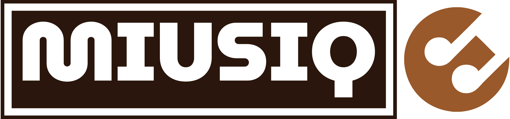

<div align="center">

</div>

<p align="center">
  

  

  <a>
    
  </a>

  
</p>

<p align="center"> The best way to find the music in you
</p>

<br>

<p align="center">
  
</p>

## :rocket: Technologies

This project was developed with:

- [React](https://reactjs.org)
- [Remix](https://remix.run/)
- [CSS3](https://developer.mozilla.org/es/docs/Web/CSS)
- [Strapi](https://strapi.io/)
- [Cloudinary](https://cloudinary.com/)

## :memo: License

This project is under the MIT license. See the file [LICENSE](LICENSE.md) for more details.

## ☝️Reproduce the project

- Visit [Remix Docs](https://remix.run/docs)

## Development

From your terminal:

```sh
npm run dev
```

This starts your app in development mode, rebuilding assets on file changes.

## Deployment

First, build your app for production:

```sh
npm run build
```

Then run the app in production mode:

```sh
npm start
```

Now you'll need to pick a host to deploy it to.

### DIY

If you're familiar with deploying node applications, the built-in Remix app server is production-ready.

Make sure to deploy the output of `remix build`

- `build/`
- `public/build/`

### Using a Template

When you ran `npx create-remix@latest` there were a few choices for hosting. You can run that again to create a new project, then copy over your `app/` folder to the new project that's pre-configured for your target server.

```sh
cd ..
# create a new project, and pick a pre-configured host
npx create-remix@latest
cd my-new-remix-app
# remove the new project's app (not the old one!)
rm -rf app
# copy your app over
cp -R ../my-old-remix-app/app app
```
